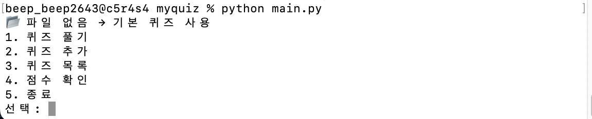
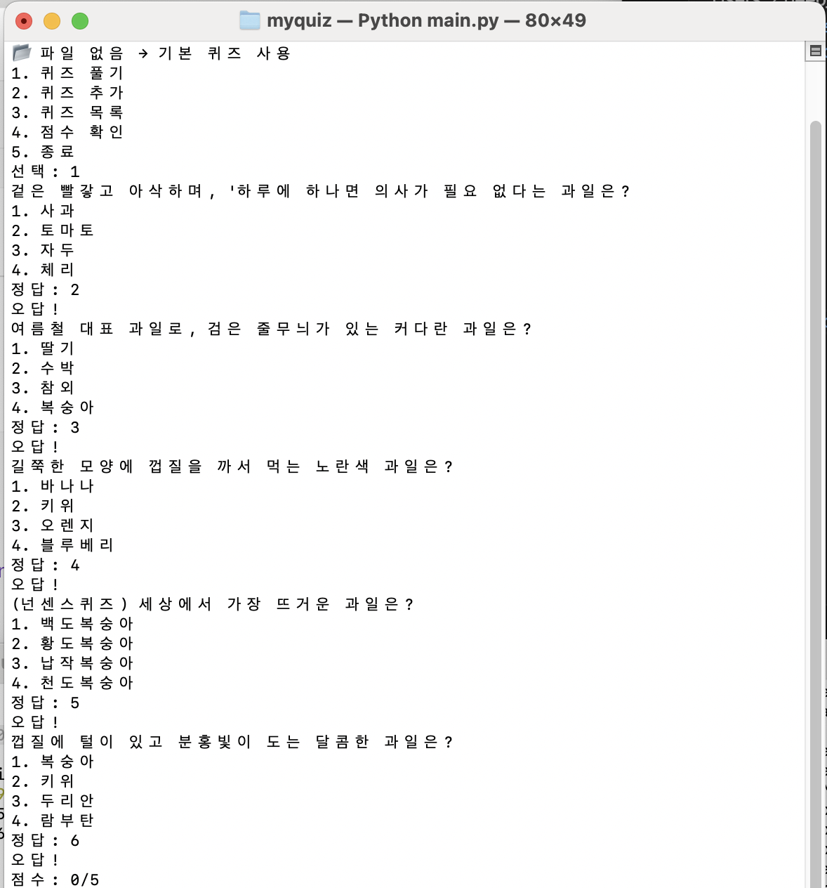
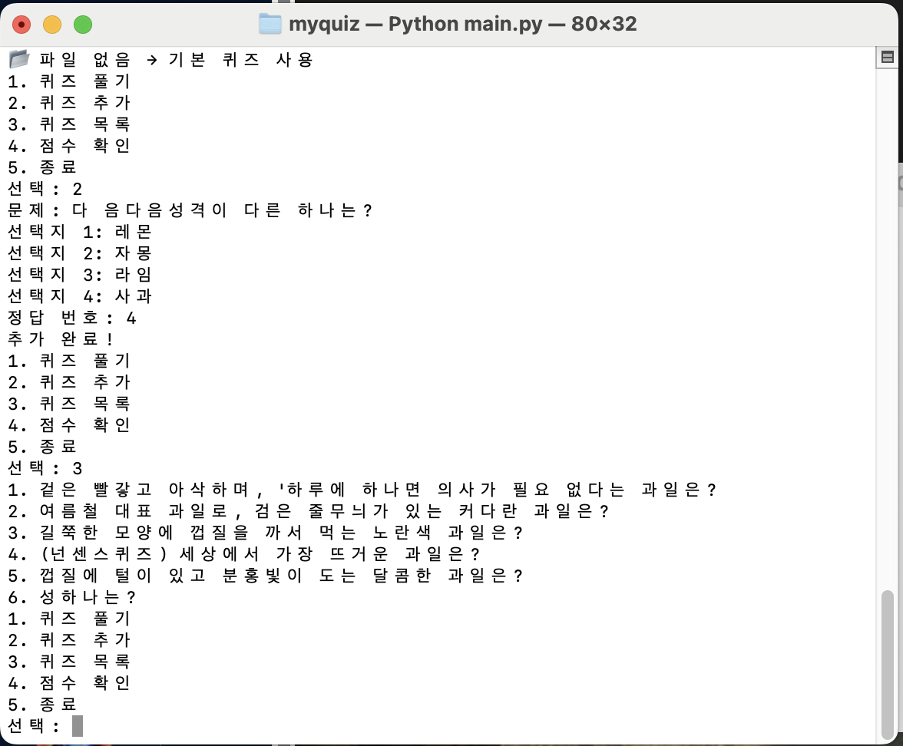
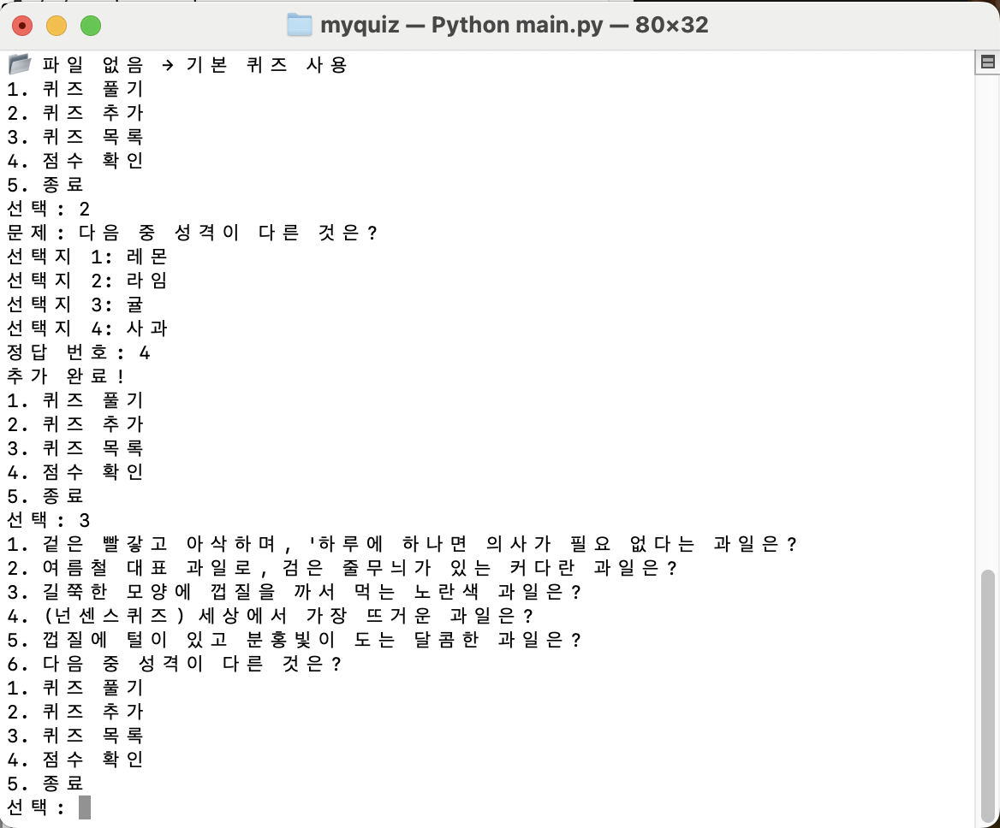
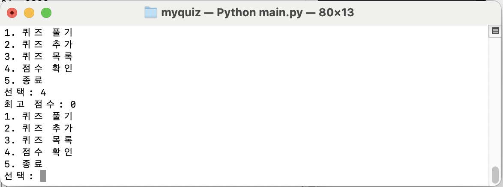
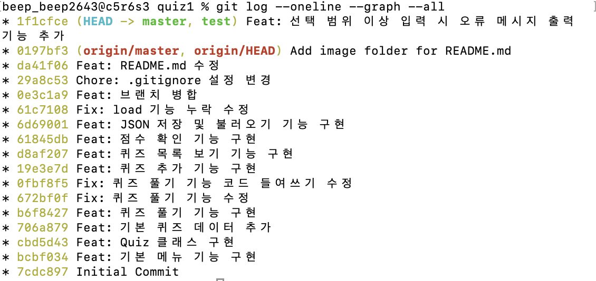

# 🎯 나만의 퀴즈 게임

## 📌 프로젝트 개요

Python으로 구현한 콘솔 기반 퀴즈 게임입니다.
사용자는 퀴즈를 풀고, 새로운 문제를 추가하며, 점수를 기록할 수 있습니다.
또한 JSON 파일을 활용하여 프로그램을 종료해도 데이터가 유지됩니다.

---

## 🎯 퀴즈 주제 선정 이유

일상에서 친숙한 **과일 관련 퀴즈**를 주제로 선정했습니다.
가볍게 즐길 수 있는 문제를 통해 사용자 경험을 높이고자 했습니다.

---

## ▶️ 실행 방법

python main.py


---

## 🧩 기능 목록

### 1. 퀴즈 풀기

* 저장된 퀴즈를 순서대로 출제
* 정답 입력 후 결과 확인
* 최종 점수 출력 및 최고 점수 갱신

### 2. 퀴즈 추가

* 새로운 문제, 선택지(4개), 정답 입력
* 입력한 퀴즈는 즉시 저장됨

### 3. 퀴즈 목록

* 현재 저장된 모든 퀴즈 확인

### 4. 점수 시스템

* 최고 점수를 저장하고 갱신

### 5. 데이터 저장

* 프로그램 종료 시 자동 저장
* 재실행 시 데이터 유지

---

## 📁 파일 구조

```
quiz-game/
├── main.py          # 프로그램 실행 파일
├── quiz.py          # Quiz 클래스 정의
├── quiz_game.py     # 게임 전체 로직
├── state.json       # 데이터 저장 파일
└── README.md        # 프로젝트 설명
```

---

## 💾 데이터 파일 설명 (state.json)

프로젝트 루트에 위치하며, 다음 정보를 저장합니다:

```json
{
    "quizzes": [
        {
            "question": "문제 내용",
            "choices": ["선택지1", "선택지2", "선택지3", "선택지4"],
            "answer": 1
        }
    ],
    "best_score": 3
}
```

### 필드 설명

* **quizzes**: 퀴즈 목록 (문제, 선택지, 정답)
* **best_score**: 최고 점수

---

## 🛠️ 개발 환경

* Python 3.10 이상
* 표준 라이브러리(json) 사용

---

## 🚀 Git 사용

* 기능 단위 커밋 진행
* 브랜치 생성 및 병합 경험
* GitHub 저장소 관리

---

## 📸 실행 예시

* 메뉴 화면


* 퀴즈 진행 화면


* 퀴즈 목록 보기 화면


* 퀴즈 추가 화면


* 점수 확인 화면


---

## git log

commit ac69414f5abab2bc0d06d46bbcf51c72704d7180 (HEAD -> master, origin/master, origin/HEAD)
Author: 임효정 <beep_beep2643@c5r6s3.codyssey.kr>
Date:   Fri Apr 24 13:44:03 2026 +0900

    feat: git log 캡처 파일 업로드

commit 1f1cfce05d22c681e83900829a3b48fc19dd8b14 (test)
Author: 임효정 <beep_beep2643@c5r6s3.codyssey.kr>
Date:   Fri Apr 24 13:33:47 2026 +0900

    Feat: 선택 범위 이상 입력 시 오류 메시지 출력 기능 추가


commit 29a8c531d4c82adacdcd293fea87d0dcb3f1f025 (HEAD -> master)
Author: 임효정 <beep_beep2643@c5r4s4.codyssey.kr>
Date:   Tue Apr 14 21:15:44 2026 +0900

    Chore: .gitignore 설정 변경

commit 0e3c1a90c9060b7a5fce4e0c2798f77daa6e9d81
Author: 임효정 <beep_beep2643@c5r4s4.codyssey.kr>
Date:   Tue Apr 14 21:14:04 2026 +0900

    Feat: 브랜치 병합

commit 61c7108b1c51fadd884110810f717879da615c8f (test)
Author: 임효정 <beep_beep2643@c5r4s4.codyssey.kr>
Date:   Tue Apr 14 21:06:24 2026 +0900

    Fix: load 기능 누락 수정

commit 6d6900112ba4bce03ac0ed5deafd126e1e4ede39
Author: 임효정 <beep_beep2643@c5r4s4.codyssey.kr>
Date:   Tue Apr 14 20:42:20 2026 +0900

    Feat: JSON 저장 및 불러오기 기능 구현

commit 61845dbebaaee627fdf28bad9cdf1610535dd03e
Author: 임효정 <beep_beep2643@c5r4s4.codyssey.kr>
Date:   Tue Apr 14 20:32:57 2026 +0900

    Feat: 점수 확인 기능 구현

commit d8af207455a8836c5fc87e71591c93d63011d6de
Author: 임효정 <beep_beep2643@c5r4s4.codyssey.kr>
Date:   Tue Apr 14 20:32:12 2026 +0900

    Feat: 퀴즈 목록 보기 기능 구현

commit 19e3e7da160a99d43592449d9c5d56fef82f6b30
Author: 임효정 <beep_beep2643@c5r4s4.codyssey.kr>
Date:   Tue Apr 14 20:29:19 2026 +0900

    Feat: 퀴즈 추가 기능 구현

commit 0fbf8f5479a5caf33b34006ec2fe8648d1b4bc87
Author: 임효정 <beep_beep2643@c5r4s4.codyssey.kr>
Date:   Tue Apr 14 20:27:29 2026 +0900

    Fix: 퀴즈 풀기 기능 코드 들여쓰기 수정

commit 672bf0f6f67cf905ec9820fd7540cb3660b67fc9
Author: 임효정 <beep_beep2643@c5r4s4.codyssey.kr>
Date:   Tue Apr 14 20:25:55 2026 +0900

    Fix: 퀴즈 풀기 기능 수정

commit b6f8427fdb104e2e5fab5109d6b0f5303a82b530
Author: 임효정 <beep_beep2643@c5r4s4.codyssey.kr>
Date:   Tue Apr 14 20:23:52 2026 +0900

    Feat: 퀴즈 풀기 기능 구현

commit 706a87964c4f3b63d9ffcd59414b21fdc21022e8
Author: 임효정 <beep_beep2643@c5r4s4.codyssey.kr>
Date:   Tue Apr 14 20:22:09 2026 +0900

    Feat: 기본 퀴즈 데이터 추가

commit cbd5d436670efaf9d5b802bae870772d5e14ff6f
Author: 임효정 <beep_beep2643@c5r4s4.codyssey.kr>
Date:   Tue Apr 14 20:21:04 2026 +0900

    Feat: Quiz 클래스 구현

commit bcbf034e7a2865585b2cfca959f3f8685ebd31ee
Author: 임효정 <beep_beep2643@c5r4s4.codyssey.kr>
Date:   Tue Apr 14 20:19:57 2026 +0900

    Feat: 기본 메뉴 기능 구현

commit 7cdc8970ea3371a240ed865b9443d8f06c0a728f
Author: 임효정 <beep_beep2643@c5r4s4.codyssey.kr>
Date:   Tue Apr 14 20:17:07 2026 +0900

    Initial Commit





## 💡 느낀 점

이번 프로젝트를 통해 Python 기본 문법뿐만 아니라
객체지향 구조, 파일 입출력, Git 사용법을 실제로 경험할 수 있었습니다.
단순한 코드 작성이 아닌, 하나의 프로그램을 완성하는 과정을 배울 수 있었습니다.
